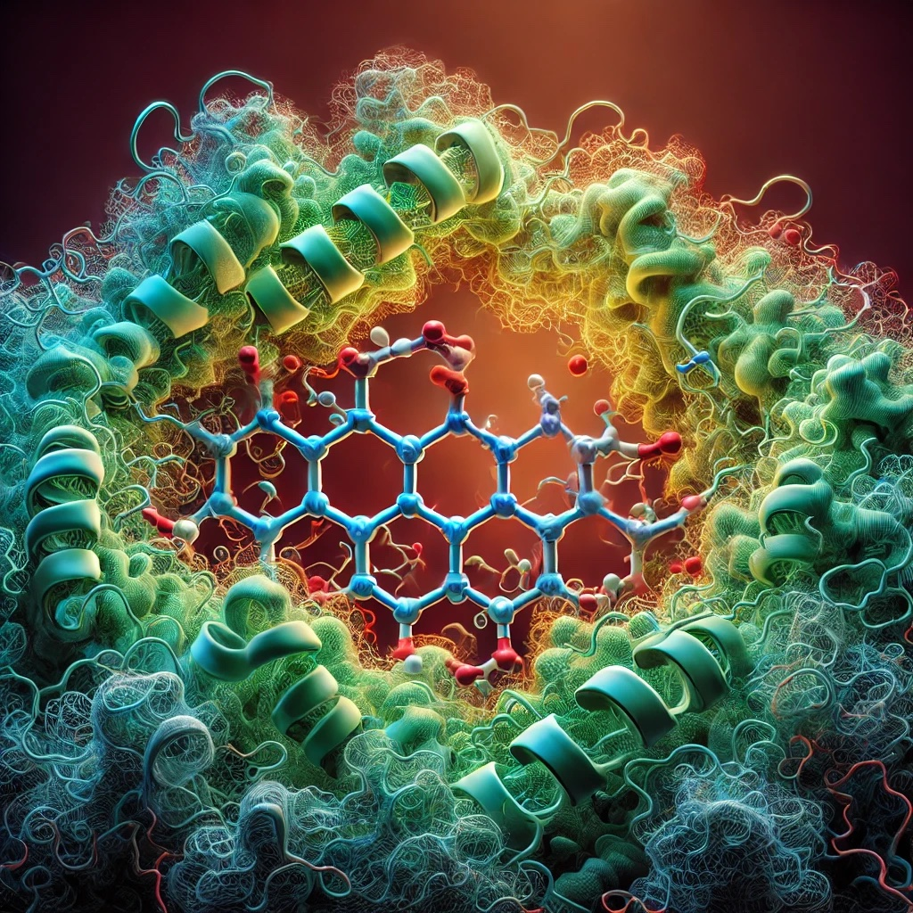

# Drug-Design

This repository contains various machine learning models that can be applied to doing drug design.

**Python Packages**: *PyTorch*, *Pandas*, *Sklearn*, *TensorFlow*, *Seaborn*, *Matplotlib*

# Models

### [1. Protein-Ligand Interaction using LLM](https://github.com/bzkarimi/ML-Projects/tree/main/water-quality)

